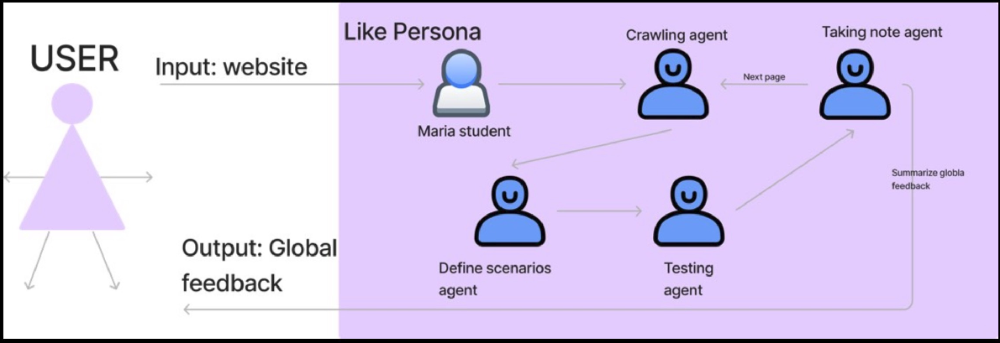

# Stella - AI-agent for beta tester 

**Description:**
Stella is an open-source platform that provides AI-agents with distinct personalities to . These virtual testers deliver instant, unbiased feedback on your digital products, making beta testing accessible, efficient, and scalable.
Features

**Flow:**
[Workflow]("images/flow.png")

24/7 Testing Availability: Get instant feedback whenever you need it
Diverse Persona Library: Access a range of virtual testers with unique perspectives
Detailed Analytics: Receive comprehensive UX/UI insights and user behavior analysis
Automated Reporting: Generate structured, actionable feedback reports
API Integration: Seamlessly integrate with your development workflow

**Installation:**
Copy# Create and activate a virtual environment
python -m venv venv
source venv/bin/activate  # On Windows, use `venv\Scripts\activate`

# Clone the repository
git clone https://github.com/seifbenayed/stella.git
cd stella

# Install required packages
pip install -r requirements.txt

**Configuration:**
Update the .env file in the project root with the following required variables:

# Selected persona ID from MongoDB
persona=your_persona_object_id ( check the list bellow)

# AI model key (supports 'gpt-4o', 'o1', 'o1-mini' or 'sonnet-3-5')
Add your key for your AI model

# AI model identifier (supports 'gpt-4o', 'o1', 'o1-mini' or 'sonnet-3-5')
llm_id=your_chosen_model

Stella comes with seven pre-configured personas, each representing different user segments:

Damien: Status-driven CEO focused on premium experiences id = 
Vincent: Growth-focused entrepreneur prioritizing ROI
Sarah: Millennial financial planner emphasizing mobile usage
Selma: Eco-conscious future parent valuing sustainability
Laure: Beauty-tech enthusiast seeking trends
Amir: Intellectual entrepreneur with analytical approach
Lina: GenZ digital native prioritizing social proof

Contributing
We welcome contributions! Please see our Contributing Guide for details.

Fork the Project
Create your Feature Branch (git checkout -b feature/AmazingFeature)
Commit your Changes (git commit -m 'Add some AmazingFeature')
Push to the Branch (git push origin feature/AmazingFeature)
Open a Pull Request

Requirements

Python >= 3.9
MongoDB >= 4.4

Support

📝 Documentation
🐛 Issue Tracker
💬 Community Forum

**License:**
This project is licensed under the APACHE 2.0 - see the LICENSE file for details.

**Acknowledgments:**
Special thanks to all contributors who have helped shape Stella's virtual testing capabilities.

